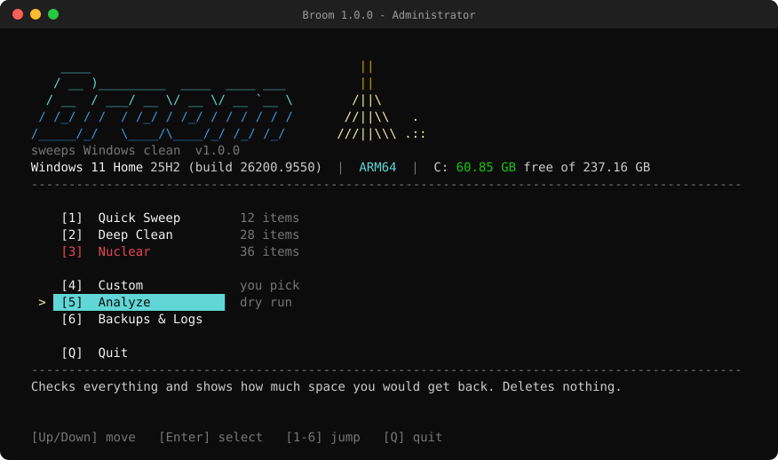
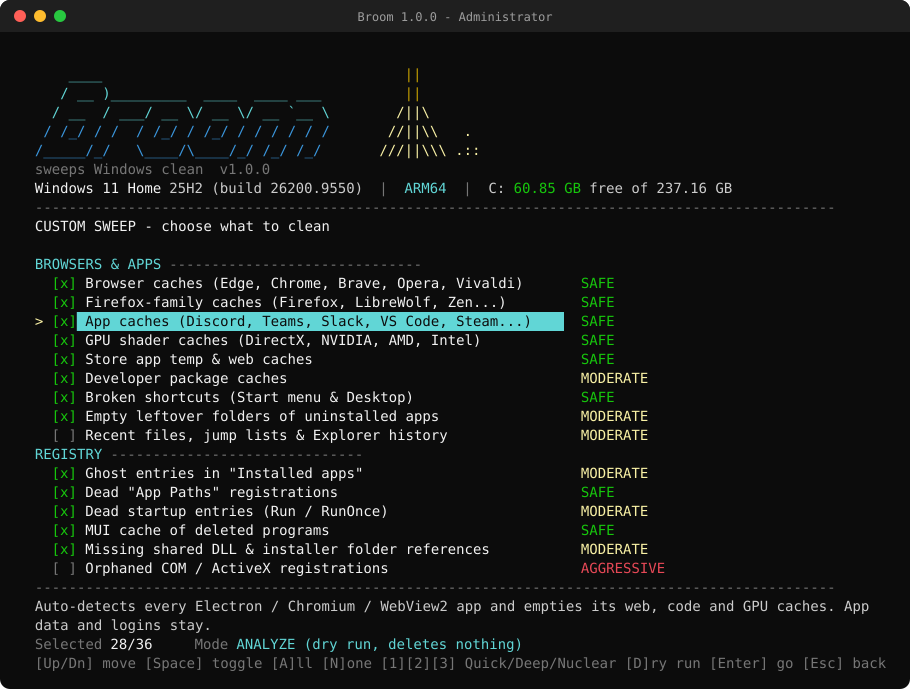
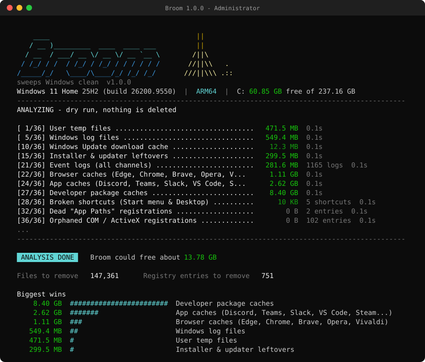

<div align="center">

```
    ____                                   ||
   / __ )_________  ____  ____ ___         ||
  / __  / ___/ __ \/ __ \/ __ `__ \       /||\
 / /_/ / /  / /_/ / /_/ / / / / / /      //||\\   .
/_____/_/   \____/\____/_/ /_/ /_/      ///||\\\ .::
```

**A thorough, transparent junk, leftover and registry cleaner for Windows 11.**
One script. No installer. No telemetry. No ads. Every change backed up.

[](https://github.com/philppplik/broom/actions/workflows/ci.yml)
[](https://github.com/philppplik/broom/releases)
[](LICENSE)


[Quick start](#-quick-start) •
[Modes](#-modes) •
[What gets cleaned](#-what-gets-cleaned) •
[Safety](#-safety-net) •
[FAQ](#-faq) •
[Full item reference](docs/ITEMS.md)



</div>

---

## ✨ Highlights

- **Keyboard-driven TUI.** Arrow keys, checkboxes, a description for every item and color-coded risk levels.
- **36 cleaning items** in four groups: system junk, updates & installers, browsers & apps, registry.
- **Dry run first.** *Analyze* shows how much each item would free and deletes nothing.
- **Registry cleaning you can check.** Every key and value is exported to a `.reg` file before it's touched, and you can restore it from inside the app.
- **Restore point** before every real run.
- **Native on ARM64 and x64.** Handles WOW64 redirection, `Program Files (x86)` and `Program Files (Arm)`.
- **Cleans every user profile**, not only the admin account you elevated with.
- **Auto-detects Electron / Chromium / WebView2 apps** (Discord, Teams, Slack, VS Code, Steam, Notion…) and clears only their caches.
- **Plain, readable PowerShell.** About 1,500 lines with nothing compiled or obfuscated, so you can read it before you run it.

## 🚀 Quick start

1. Download **`broom.zip`** from [Releases](https://github.com/philppplik/broom/releases) and extract it anywhere.
2. Double-click **`Broom.cmd`** and approve the admin prompt.
3. Choose **5 · Analyze** first to see what it finds. Then run **Quick Sweep** or **Deep Clean**.

That's it. Nothing to install and nothing left behind except logs and backups in `C:\ProgramData\Broom`.

<details>
<summary><b>Other ways to install</b></summary>

**Clone with git**

```powershell
git clone https://github.com/philppplik/broom.git
cd broom
.\Broom.cmd
```

**One-off download in PowerShell**

```powershell
$zip = "$env:TEMP\broom.zip"
Invoke-WebRequest https://github.com/philppplik/broom/releases/latest/download/broom.zip -OutFile $zip
Expand-Archive $zip "$env:USERPROFILE\Broom" -Force
& "$env:USERPROFILE\Broom\Broom.cmd"
```

**Verify the download (optional)**

Every release includes `SHA256SUMS.txt`:

```powershell
Get-FileHash .\broom.zip -Algorithm SHA256
```

</details>

### Requirements

| | |
|---|---|
| OS | Windows 11 (Windows 10 mostly works but is not tested) |
| CPU | x64 (Intel / AMD) or ARM64 (Snapdragon) |
| Shell | Windows PowerShell 5.1 (built in) or PowerShell 7.x |
| Rights | Administrator (Broom asks for elevation itself) |
| Terminal | Windows Terminal or the classic console, at least 100×34 recommended |

## 🧹 Modes

| | Mode | Items | What it means |
|---|---|:-:|---|
| 1 | **Quick Sweep** | 12 | Safe everyday junk: temp files, caches, logs, update downloads, crash dumps, Recycle Bin. |
| 2 | **Deep Clean** | 28 | Quick + Windows.old, WinSxS, Disk Cleanup, installer leftovers, app/dev caches, broken shortcuts, registry. |
| 3 | **Nuclear** | 36 | Everything, including old drivers, old restore points, hibernation, reserved storage, event logs, COM registry and history. |
| 4 | **Custom** | – | Pick items one by one. Can also run as a dry run (press `D`). |
| 5 | **Analyze** | 36 | Dry run of everything. Deletes nothing. |
| 6 | **Backups & Logs** | – | Restore registry backups, open logs, launch System Restore. |

<div align="center">

</div>

### Keys

| Screen | Keys |
|---|---|
| Main menu | `↑` `↓` move · `Enter` select · `1`–`6` jump · `Q` / `Esc` quit |
| Custom picker | `Space` toggle · `A` all · `N` none · `1` `2` `3` load preset · `D` dry run · `PgUp` `PgDn` `Home` `End` · `Enter` go · `Esc` back |
| Prompts | `Y` / `N` / `Enter` = default / `Esc` = no |

## 🗂 What gets cleaned

Risk levels: 🟢 **Safe**: nothing you'd miss · 🟡 **Moderate**: rebuilt automatically or loses a convenience · 🔴 **Aggressive**: removes a way back.

<details open>
<summary><b>System junk</b></summary>

| Item | Risk | Tier |
|---|:-:|:-:|
| User temp files (all profiles) | 🟢 | Quick |
| Windows temp files | 🟢 | Quick |
| Error reports (WER) | 🟢 | Quick |
| Crash & memory dumps | 🟢 | Quick |
| Windows log files (CBS, DISM, setup, update) | 🟢 | Quick |
| Recycle Bin (all drives, all users) | 🟡 | Quick |
| DNS, ARP & NetBIOS caches | 🟢 | Quick |
| Thumbnail & icon cache | 🟡 | Deep |
| Prefetch data | 🟡 | Nuclear |

</details>

<details>
<summary><b>Updates & installers</b></summary>

| Item | Risk | Tier |
|---|:-:|:-:|
| Windows Update download cache | 🟢 | Quick |
| Delivery Optimization cache | 🟢 | Quick |
| Old Windows installations (Windows.old, `$Windows.~BT`…) | 🟡 | Deep |
| Windows Disk Cleanup, every category except Downloads | 🟡 | Deep |
| Component store cleanup (`DISM /ResetBase`) | 🟡 | Deep |
| Installer & updater leftovers (C:\AMD, C:\NVIDIA, MSOCache, Squirrel packages…) | 🟡 | Deep |
| Orphaned Windows Installer packages (`C:\Windows\Installer`) | 🔴 | Nuclear |
| Old driver versions (DriverStore) | 🔴 | Nuclear |
| Old restore points & shadow copies (newest kept) | 🔴 | Nuclear |
| Hibernation file `hiberfil.sys` | 🔴 | Nuclear |
| Reserved storage | 🔴 | Nuclear |
| Event logs (all channels) | 🔴 | Nuclear |

</details>

<details>
<summary><b>Browsers & apps</b></summary>

| Item | Risk | Tier |
|---|:-:|:-:|
| Browser caches: Edge, Chrome, Brave, Opera, Vivaldi | 🟢 | Quick |
| Firefox-family caches: Firefox, LibreWolf, Waterfox, Zen | 🟢 | Quick |
| App caches: every Electron / Chromium / WebView2 app, auto-detected | 🟢 | Quick |
| GPU shader caches (DirectX, NVIDIA, AMD, Intel) | 🟢 | Deep |
| Store app temp & web caches | 🟢 | Deep |
| Developer caches: npm, Yarn, pnpm, pip, uv, Poetry, NuGet, Go, Cargo, Composer, Scoop, Chocolatey | 🟡 | Deep |
| Broken shortcuts (Start menu & Desktop) | 🟢 | Deep |
| Empty leftover folders of uninstalled apps | 🟡 | Deep |
| Recent files, jump lists & Explorer history | 🟡 | Nuclear |

</details>

<details>
<summary><b>Registry</b></summary>

| Item | Risk | Tier |
|---|:-:|:-:|
| Ghost entries in "Installed apps" | 🟡 | Deep |
| Dead "App Paths" registrations | 🟢 | Deep |
| Dead startup entries (Run / RunOnce + Task Manager toggle) | 🟡 | Deep |
| MUI cache of deleted programs | 🟢 | Deep |
| Missing SharedDLLs & Installer folder references | 🟡 | Deep |
| Orphaned COM / ActiveX registrations | 🔴 | Nuclear |

</details>

👉 Exact paths, keys and rules for every item: **[docs/ITEMS.md](docs/ITEMS.md)**

<div align="center">

</div>

## 🛡 Safety net

Broom is built to be aggressive about junk and careful about everything else.

| Guard | How |
|---|---|
| **Restore point** | Created before every real run. Windows' one-per-24h limit is lifted for this one call. |
| **Registry backups** | Each touched key is exported once per run to `C:\ProgramData\Broom\Backups\<timestamp>\NNNN.reg`. Restore from menu `6`. |
| **Protected folders** | Documents, Downloads, Pictures, Videos, Music, Favorites, OneDrive and drive/system roots are hard-blocked. The Desktop only loses broken `.lnk` files. |
| **No link following** | Junctions, symlinks and cloud placeholders (OneDrive) are never traversed or deleted through. |
| **Locked files** | Skipped silently, never forced. |
| **Conservative "missing" check** | A registry entry counts as orphaned only if its path is absolute, the drive exists, its parent folder can actually be read, and no `System32`/`SysWOW64`/`SysArm32` or `Program Files`/`(x86)`/`(Arm)` variant exists. Network and removable paths are never judged. |
| **Never touched** | Passwords, cookies, browser history, `ProgramData\Package Cache`, MSI-based uninstall entries, your Downloads (even in Disk Cleanup). |
| **Logs** | Every run, every registry change and every removed shortcut/package is logged to `C:\ProgramData\Broom\Logs`. |

## 🤖 Unattended / scheduled use

```powershell
# Dry run, no prompts
powershell -ExecutionPolicy Bypass -File .\Broom.ps1 -Mode Analyze -Yes

# Weekly deep clean without questions
powershell -ExecutionPolicy Bypass -File .\Broom.ps1 -Mode Deep -Yes
```

| Parameter | Description |
|---|---|
| `-Mode Menu\|Quick\|Deep\|Nuclear\|Analyze` | Default `Menu` (the TUI). Anything else runs once and exits. |
| `-Yes` | Skips confirmations and leaves running apps open (their locked files are skipped). |
| `-NoRestorePoint` | Skips the System Restore point. |
| `-NoElevate` | For testing only: runs without admin rights, and many items are skipped. |

Example scheduled task (weekly, Sunday 3 AM, as SYSTEM):

```powershell
$a = New-ScheduledTaskAction -Execute powershell.exe -Argument '-NoProfile -ExecutionPolicy Bypass -File "C:\Tools\Broom\Broom.ps1" -Mode Quick -Yes'
$t = New-ScheduledTaskTrigger -Weekly -DaysOfWeek Sunday -At 3am
Register-ScheduledTask -TaskName Broom -Action $a -Trigger $t -User SYSTEM -RunLevel Highest
```

## ❓ FAQ

<details>
<summary><b>Is it safe?</b></summary>

As safe as a deep cleaner can be: restore point, `.reg` backups, protected folders, no link following, and a dry run to check first. Still, **Nuclear** removes rollback options on purpose (Windows.old, update uninstall, old restore points). Run **Analyze** first if you're unsure.
</details>

<details>
<summary><b>Windows says "running scripts is disabled on this system".</b></summary>

Use `Broom.cmd`. It starts PowerShell with `-ExecutionPolicy Bypass` for this one process and doesn't change your system policy. If you downloaded the ZIP, you can also run `Unblock-File .\Broom.ps1`.
</details>

<details>
<summary><b>SmartScreen / antivirus warns about it.</b></summary>

Unsigned scripts that delete files and edit the registry sometimes get flagged by heuristics. The source is all here and readable. Compare `SHA256SUMS.txt` from the release if you want to be sure your copy wasn't altered.
</details>

<details>
<summary><b>Will I be logged out of websites or lose passwords?</b></summary>

No. Only cache folders are emptied. Cookies, saved passwords, history and extensions stay.
</details>

<details>
<summary><b>Why does Analyze show 0 B for WinSxS / Disk Cleanup / Windows.old?</b></summary>

Those are handled by Windows' own tools (DISM, cleanmgr), which can't report a size up front. On a real run Broom measures the actual free-space difference.
</details>

<details>
<summary><b>The freed space is lower than Analyze predicted.</b></summary>

Files in use (open browsers, running apps, active logs) are skipped. Close apps when Broom asks, or restart and run it again.
</details>

<details>
<summary><b>How do I undo a registry change?</b></summary>

Main menu → **6 Backups & Logs** → press the number of the backup. Or double-click any `.reg` file in `C:\ProgramData\Broom\Backups\<timestamp>`. For everything else, use the restore point (press `S` on the same screen).
</details>

<details>
<summary><b>I want hibernation / Fast Startup back.</b></summary>

`powercfg /h on` in an admin terminal. Reserved storage: `DISM /Online /Set-ReservedStorageState /State:Enabled`.
</details>

<details>
<summary><b>Does it work on ARM64 (Snapdragon / Copilot+ PCs)?</b></summary>

Yes. Broom was developed on a Windows 11 ARM64 machine and runs natively there. It detects the native architecture and handles x86/x64 emulation paths. CI runs it on both `windows-latest` (x64) and `windows-11-arm`.
</details>

<details>
<summary><b>Does it phone home or update itself?</b></summary>

No network access at all. Updates are manual: download a new release.
</details>

<details>
<summary><b>Why PowerShell and not a .exe?</b></summary>

So you can read every line before giving it admin rights. Nothing is compiled, packed or hidden.
</details>

<details>
<summary><b>How do I remove Broom?</b></summary>

Delete its folder and `C:\ProgramData\Broom`. It installs nothing else.
</details>

## 🧩 Project layout

```
Broom.ps1               the whole tool (bootstrap, engine, tasks, TUI, runner)
Broom.cmd               double-click launcher
docs/ITEMS.md           exact rules for every cleaning item
docs/screenshots/       README images
.github/                CI, release pipeline, templates, Dependabot
```

## 🤝 Contributing

Ideas, bug reports and new cleaning items are welcome. Please read [CONTRIBUTING.md](CONTRIBUTING.md). The short version: every new item needs a dry-run path, must never follow reparse points, and must back up registry changes. Security issues → [SECURITY.md](SECURITY.md).

## 📜 License

[MIT](LICENSE) © 2026 Philipp Paulik

<sub>Broom is provided "as is", without warranty. It deletes things; that's the point. Read what an item does before you tick it.</sub>
