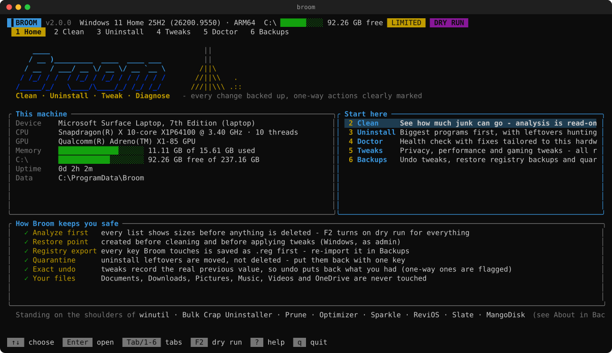
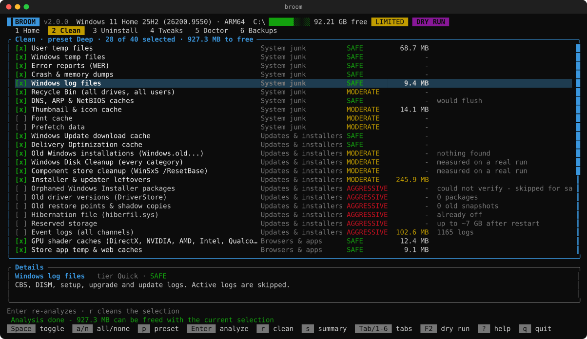
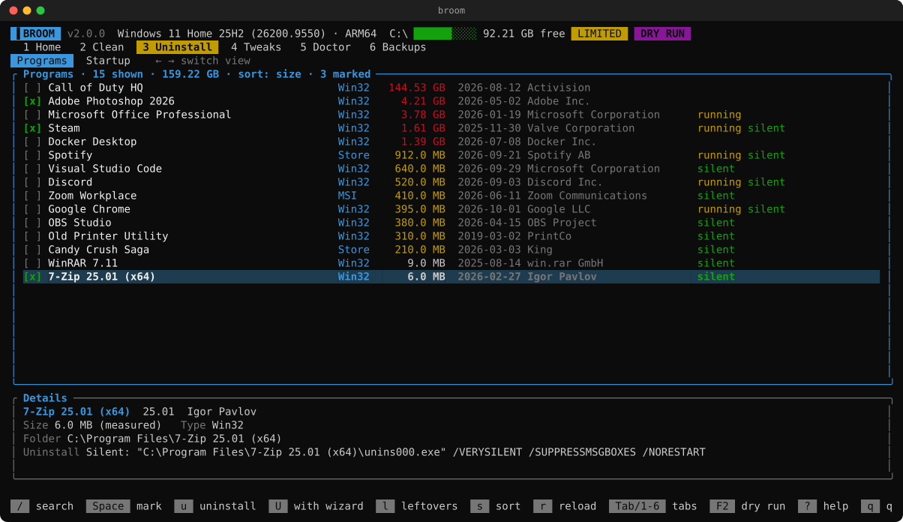
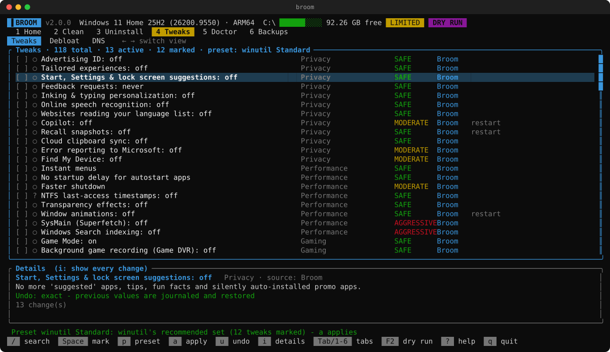
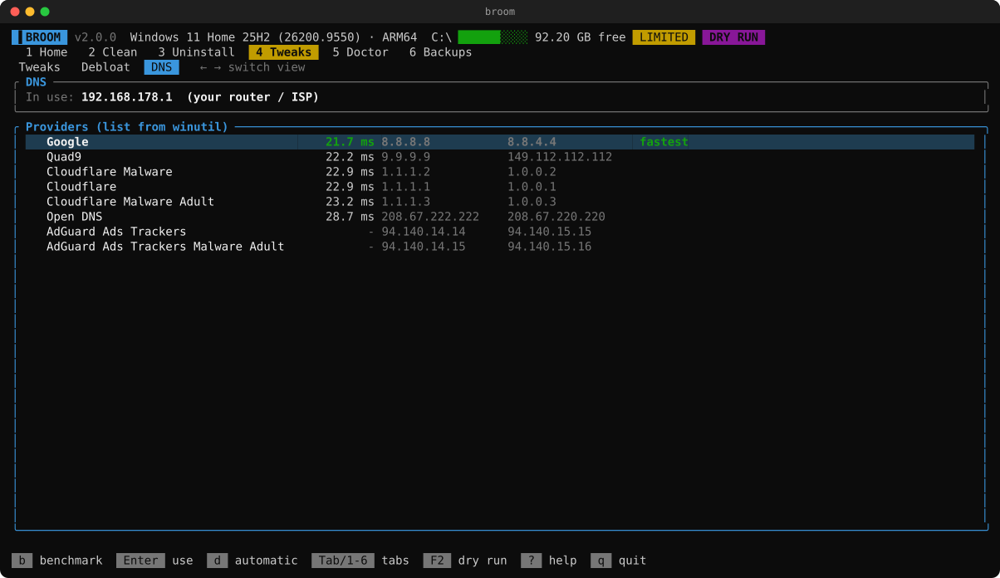
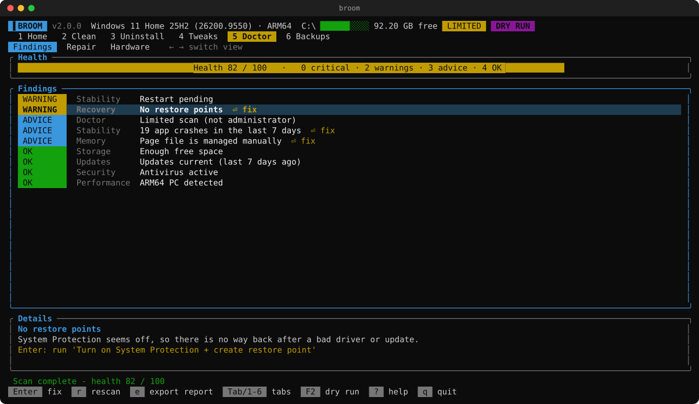
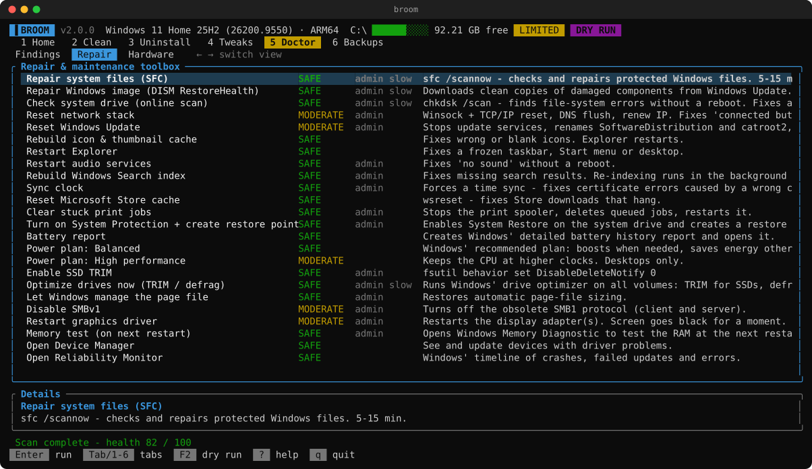
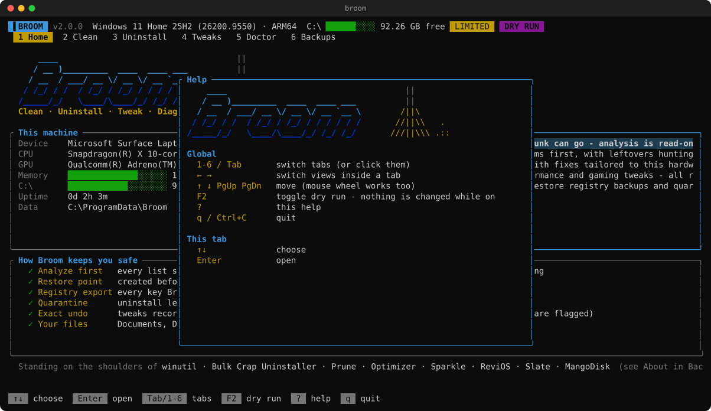

<div align="center">

```
    ____                                   ||
   / __ )_________  ____  ____ ___         ||
  / __  / ___/ __ \/ __ \/ __ `__ \       /||\
 / /_/ / /  / /_/ / /_/ / / / / / /      //||\\   .
/_____/_/   \____/\____/_/ /_/ /_/      ///||\\\ .::
```

### Clean · Uninstall · Tweak · Diagnose — one terminal UI for Windows, macOS and Linux.

Every change backed up. Undo that restores your exact previous settings. No telemetry, no ads, no account.

[](https://github.com/philppplik/broom/actions/workflows/ci.yml)
[](https://github.com/philppplik/broom/releases/latest)
[](https://github.com/philppplik/broom/releases)
[](LICENSE)


[**Download**](#-download) · [Tour](#-a-quick-tour) · [Safety](#-safety-net) · [CLI](#-command-line) · [FAQ](#-faq) · [Credits](#-credits)



</div>

---

## ✨ What's inside

| | Module | What it does |
|---|---|---|
| 🧹 | **Clean** | 40 Windows / 20 macOS / 17 Linux cleaning items: temp & update caches, Windows.old, WinSxS, browser & Electron app caches, GPU shader caches, package-manager caches, **stale build output in your projects**, Docker cache, registry leftovers. Read-only analysis first. |
| 🗑️ | **Uninstall** | Every Win32, MSI and Store app (macOS: `.app` + Homebrew; Linux: deb/rpm/pacman/Flatpak/Snap) with **measured** sizes. Silent uninstall where it's safe, then a **leftover hunt** with confidence levels. Leftovers go to **quarantine**, not oblivion. Plus a **startup manager**. |
| 🎛️ | **Tweaks** | 118 Windows tweaks (71 from winutil's catalog incl. 9 optional Windows features + 47 of Broom's own for privacy, gaming, performance, Explorer, services, network, power), presets, **Debloat** for preinstalled apps, a **DNS manager** that benchmarks resolvers from your PC. macOS and Linux tweaks too. **Undo restores the exact previous value** (80 of 118 tweaks; the rest use their undo script or are marked as one-way). |
| 🩺 | **Doctor** | Knows your hardware (laptop vs. desktop, GPU vendor, SSD/HDD/NVMe, RAM speed vs. rating, battery wear, TPM, Secure Boot…) and checks ~40 things: blue screens, disk errors, driver problems, pending restarts, security gaps. Hardware-aware recommendations with one-key fixes, plus a **repair toolbox** (SFC, DISM, network & Windows Update reset, …). |
| 🛟 | **Backups** | Tweak journal (undo any tweak), registry backups (re-import), quarantine (restore or purge), credits. |

## 📸 A quick tour

<table>
<tr>
<td width="50%"><b>Clean</b> — analysis first, then sweep<br></td>
<td width="50%"><b>Uninstall</b> — biggest first, silent where possible<br></td>
</tr>
<tr>
<td><b>Tweaks</b> — presets, live state, exact undo<br></td>
<td><b>DNS manager</b> — real queries, fastest wins<br></td>
</tr>
<tr>
<td><b>Doctor</b> — health score and one-key fixes<br></td>
<td><b>Repair toolbox</b><br></td>
</tr>
</table>

<sub>Screenshots are rendered from the real UI (`broom snapshot`). The program list uses demo data so no one's actual software is published.</sub>

## 📦 Download

| Platform | Get it |
|---|---|
| **Windows** x64 (Intel/AMD) | [`broom-windows-x64.zip`](https://github.com/philppplik/broom/releases/latest/download/broom-windows-x64.zip) |
| **Windows** ARM64 (Snapdragon / Copilot+ PCs) | [`broom-windows-arm64.zip`](https://github.com/philppplik/broom/releases/latest/download/broom-windows-arm64.zip) |
| **macOS** 11+ (Apple Silicon + Intel) | [`broom-macos-universal.dmg`](https://github.com/philppplik/broom/releases/latest/download/broom-macos-universal.dmg) |
| **Debian / Ubuntu / Mint** | `broom_*_amd64.deb` · `broom_*_arm64.deb` on the [release page](https://github.com/philppplik/broom/releases/latest) |
| **Fedora / RHEL / openSUSE** | `broom-*.x86_64.rpm` · `broom-*.aarch64.rpm` on the [release page](https://github.com/philppplik/broom/releases/latest) |
| **Any Linux** | [`broom-linux-x64.tar.gz`](https://github.com/philppplik/broom/releases/latest/download/broom-linux-x64.tar.gz) · [`broom-linux-arm64.tar.gz`](https://github.com/philppplik/broom/releases/latest/download/broom-linux-arm64.tar.gz) |

Every release has a `SHA256SUMS.txt`. Releases are built by GitHub Actions from the tagged source.

### One-line install

**Windows** (PowerShell) — installs to `%LOCALAPPDATA%\Programs\Broom`, adds a Start-menu entry and `broom` to your PATH:

```powershell
irm https://raw.githubusercontent.com/philppplik/broom/main/scripts/install.ps1 | iex
```

**macOS / Linux** — installs to `~/.local/bin`:

```bash
curl -fsSL https://raw.githubusercontent.com/philppplik/broom/main/scripts/install.sh | sh
```

Both installers verify the SHA-256 checksum before installing anything.

<details>
<summary><b>Manual install details per OS</b></summary>

**Windows** — unzip anywhere and run `broom.exe`. It asks for administrator rights (needed for system-wide cleaning, registry and services). Run with `--no-elevate` to skip that.

**macOS** — open the DMG and drag **Broom.app** to Applications. Double-clicking it opens Terminal with Broom. Run *Install command-line tool* from the DMG to get `broom` in every terminal. The app isn't notarized yet, so the first time right-click → **Open**, or run `xattr -dr com.apple.quarantine /Applications/Broom.app`.

**Debian/Ubuntu** — `sudo apt install ./broom_*_amd64.deb` · **Fedora** — `sudo dnf install ./broom-*.x86_64.rpm`

Use `sudo broom` for system-wide items (package caches, journal, system logs); without sudo Broom cleans your user data and skips the rest.

**From source** — `cargo install --git https://github.com/philppplik/broom` (Rust 1.85+).
</details>

## ⌨️ Using it

```
broom                 open the TUI
broom --tab doctor    open a specific tab
broom --dry-run       nothing is changed, everything is reported
```

| Keys | |
|---|---|
| `1`–`6`, `Tab`, mouse click | switch tabs |
| `←` `→` | switch views inside a tab (Programs ↔ Startup, Tweaks ↔ Debloat ↔ DNS, Findings ↔ Repair ↔ Hardware…) |
| `↑` `↓` `PgUp` `PgDn`, mouse wheel | move |
| `Space` | tick / untick |
| `Enter` | the main action of the tab (analyze, apply, fix, restore…) |
| `/` | search (Uninstall, Tweaks) |
| `F2` | **dry-run mode** for everything |
| `?` | help · `q` quit |



## 🛟 Safety net

Broom is aggressive about junk and conservative about everything else.

| Guard | How it works |
|---|---|
| **Analyze before delete** | Clean analyzes read-only on open. `F2` / `--dry-run` turns every module into a simulation. |
| **Restore point** | Created before cleaning and before applying tweaks (Windows, as admin; the 1-per-24h limit is lifted for that call). |
| **Registry export** | Every key Broom changes or deletes is exported to `.reg` first — re-import from the Backups tab. |
| **Exact undo** | Registry, service and settings tweaks journal the *actual* previous value (or "didn't exist"), so undo restores precisely what you had. Script-based tweaks use their undo script; the few one-way actions are flagged red before you confirm. |
| **Quarantine** | Uninstall leftovers are moved, not deleted. Restore with one key; purge when you're sure. |
| **No link following** | Deletion never traverses junctions, symlinks or cloud placeholders (OneDrive "files on demand"). [Tested in CI](src/util/fs.rs). |
| **Protected places** | Documents, Downloads, Pictures, Music, Videos, OneDrive/iCloud/Dropbox and system roots are hard-blocked. Downloads is excluded even from Windows' own Disk Cleanup. |
| **Conservative "missing" test** | A registry entry is orphaned only if the drive exists, the parent folder is readable, and no `System32`↔`SysWOW64`/`SysArm32` or `Program Files`↔`(x86)`/`(Arm)` variant exists. |
| **Thread-safe dry run** | An analysis running in one tab can never turn a real job in another tab into a simulation, or vice versa. |
| **Logs** | Everything is logged to the data folder (`%ProgramData%\Broom`, `~/Library/Application Support/Broom`, `~/.local/share/broom`). |

## 🤖 Command line

Everything the TUI does is scriptable — great for scheduled maintenance and fleets.

```bash
broom clean --tier quick              # analysis only (read-only)
broom clean --tier deep --yes         # actually clean
broom clean --tier nuclear --json     # machine-readable
broom uninstall --measure --json      # inventory with real sizes
broom tweaks list                     # ● applied  ○ not applied  ? unknown
broom tweaks apply ads-id-off game-dvr-off hags-on
broom tweaks undo hags-on
broom doctor --json > health.json
broom dns                             # benchmark public DNS from this machine
```

## ❓ FAQ

<details><summary><b>Is it safe?</b></summary>

As safe as a deep cleaner can be — see the [safety net](#-safety-net). Aggressive items (old restore points, Windows.old, hibernation, COM registry…) are clearly marked red and never part of the Quick preset. Try `--dry-run` first.
</details>

<details><summary><b>Windows SmartScreen / my antivirus warns about broom.exe</b></summary>

Broom isn't code-signed yet (certificates are expensive for a free project). Tools that delete files and edit the registry also trip heuristics. The binary is built by GitHub Actions from this repo; compare the hash with `SHA256SUMS.txt`, or build it yourself with `cargo build --release`.
</details>

<details><summary><b>Will I be logged out of websites?</b></summary>

No. Only cache folders are emptied. Cookies, passwords, history and extensions stay.
</details>

<details><summary><b>How do I undo a tweak?</b></summary>

Tweaks tab → select it → `u`. Or Backups → Tweak journal → `Enter`. Undo uses the value Broom recorded before applying it. If a tweak was applied by another tool, Broom falls back to the documented default.
</details>

<details><summary><b>An uninstall removed too much / a leftover was needed</b></summary>

Backups → Quarantine → select the set → `Enter`. Files go back to where they were. Registry keys can be re-imported from Backups → Registry backups.
</details>

<details><summary><b>Why does the Doctor say "Limited scan"?</b></summary>

Disk health (SMART), BitLocker, restore points and the Windows component store can only be read with administrator rights. Start Broom normally (it asks for elevation) instead of with `--no-elevate`.
</details>

<details><summary><b>Does it work on Snapdragon / ARM64?</b></summary>

Yes — Broom is developed on a Windows 11 ARM64 laptop and ships native ARM64 builds for Windows, macOS and Linux. CI tests on ARM64 Windows and Linux runners.
</details>

<details><summary><b>Does it phone home?</b></summary>

No. The only network traffic is the DNS benchmark you start yourself (DNS queries to the providers listed) and the package downloads Windows/winget make when you reinstall a removed Store app.
</details>

<details><summary><b>Where did the PowerShell version go?</b></summary>

Broom 1.x lives on in [`legacy/`](legacy/) and its [v1.0.0 release](https://github.com/philppplik/broom/releases/tag/v1.0.0). 2.0 is a rewrite in Rust with a real TUI and macOS/Linux support.
</details>

## 🧩 Project layout

```
src/
  clean/       cleaning catalog per OS + shared browser/app/developer items
  uninstall/   programs, leftovers, quarantine, startup manager
  tweaks/      tweak engine + journal, Broom's catalogs, winutil interpreter, debloat, DNS
  doctor/      hardware facts, findings, repair actions per OS
  tui/         Ratatui app: tabs, jobs, modals, theme, headless snapshot/export
  util/        safe file system, registry with backups, system facts
third_party/   embedded winutil data (MIT)
packaging/     macOS app bundle + DMG builder
scripts/       one-line installers
legacy/        Broom 1.x (PowerShell)
```

## 🤝 Contributing

Bug reports, new cleaning items and tweaks are very welcome — see [CONTRIBUTING.md](CONTRIBUTING.md). Security issues: [SECURITY.md](SECURITY.md).

## 🙏 Credits

Broom stands on the shoulders of these projects — please star them:

- **[winutil](https://github.com/ChrisTitusTech/winutil)** by Chris Titus Tech (MIT) — Broom embeds its tweak, feature, app and DNS catalogs unmodified.
- **[Bulk Crap Uninstaller](https://github.com/BCUninstaller/Bulk-Crap-Uninstaller)** by Marcin Szeniak (Apache-2.0) and **[Prune](https://github.com/jimman0I/prune)** by jimman0I (MIT) — the uninstaller follows their approach to silent uninstalls, leftover detection and quarantine.
- **[Optimizer](https://github.com/hellzerg/optimizer)** (hellzerg), **[Sparkle](https://github.com/thedogecraft/sparkle)** (thedogecraft), **[ReviOS Playbook](https://github.com/meetrevision/playbook)** (Revision), **[Slate](https://github.com/QuiteAFancyEmerald/Slate-Desktop-for-Windows-11)** (QuiteAFancyEmerald) and **[MangoDisk](https://github.com/harry0703/MangoDisk)** (harry0703) — their feature sets inspired Broom's own tweaks, DNS benchmark, repair tools and developer cleanup. These are GPL/CC-BY-SA, so no code was copied.

Details in [THIRD-PARTY-NOTICES.md](THIRD-PARTY-NOTICES.md).

## 📜 License

[MIT](LICENSE) © 2026 Philipp Paulik

<sub>Broom is provided as is, without warranty. It deletes things — that's the point. Read what an item does before you tick it.</sub>
